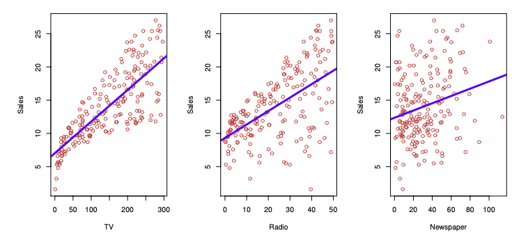
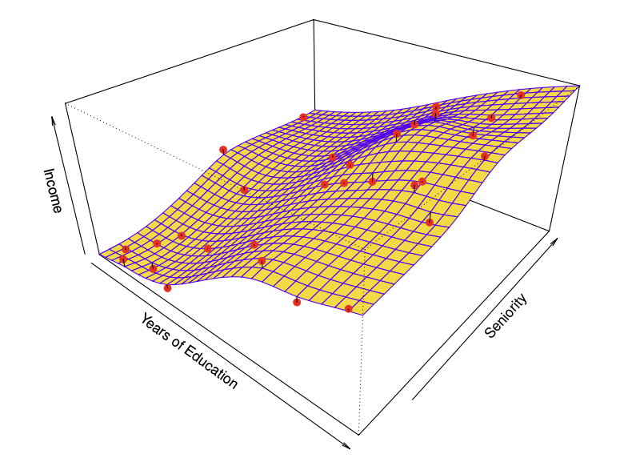
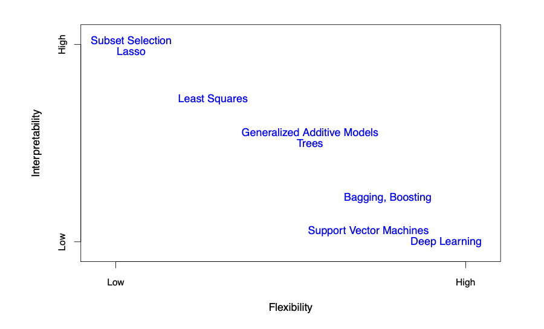
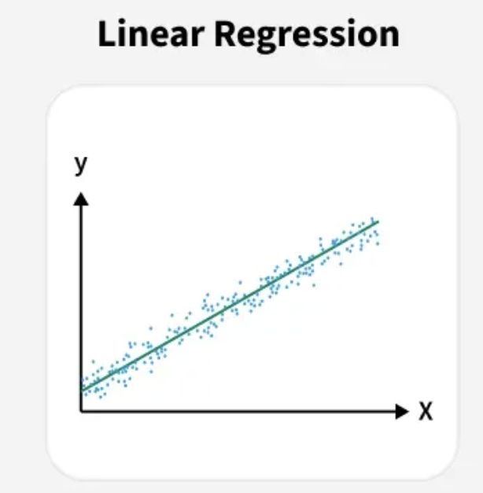
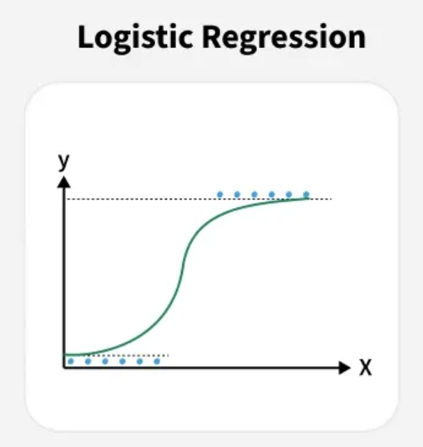
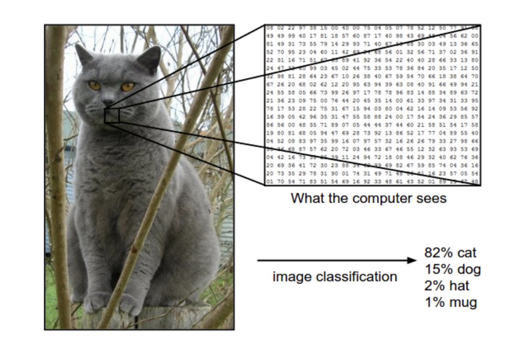
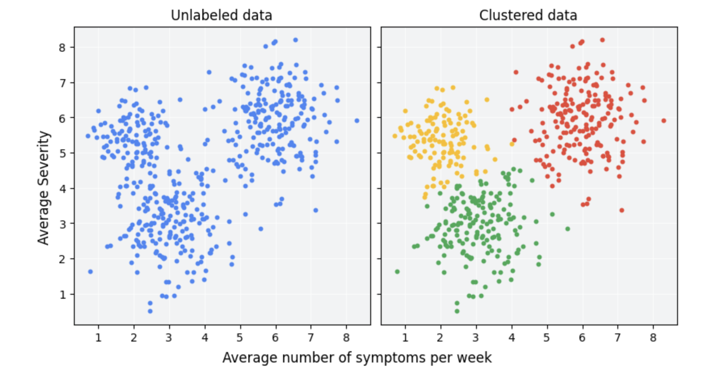
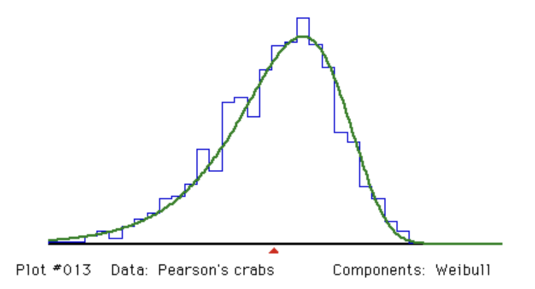
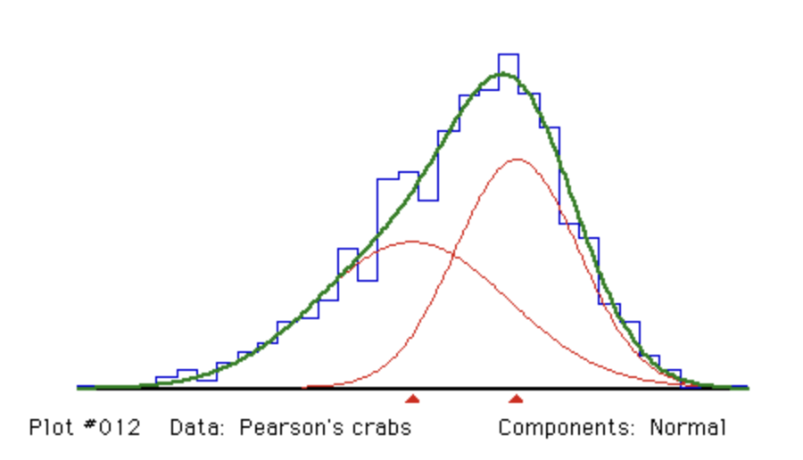

## Talk Overview {.smaller}

- Section 2.1 of *An Introduction to Statistical Learning*:
  1. What Is Statistical Learning?
  2. Why Estimate *f*?
  3. How Do We Estimate *f*?
  4. The Trade-Off Between Prediction Accuracy and Model Interpretability
  5. Supervised vs. Unsupervised Learning
  6. Regression vs. Classification Problems
  
## Knowing by Predicting
- What's common between a store's sales, a car's rating, an university's reputation, and your expected lifespan? 

## Knowing by Predicting
- What's common between a store's sales, a car's rating, an university's reputation, and your expected lifespan? 
- They are all factors that can be predicted from other factors.

## Knowing by Predicting
- A store's sales: budget across TV, radio, and newspaper, etc.
- A car's rating: newness, size, maximal acceleration, comfort level, etc. 
- A university's reputation: faculty members' total amount of citations, academic awards won; its acceptance rate, external rankings, its employer trust, etc. 
- Your expected lifespan: hours of sleep per day, calories intake, smoke or not, family earning bracket, disabilities, etc.

::: {.notes}
That's right! 

In short, each of them may be seen as an output, aka a response or dependent variable, a function of other predictors, aka features, indep vars, etc. 

In order to develop models which best predict those outputs, we want the models to approximate the function as closely as possible, based on only the data we know. This is the whole purpose of statistical learning, which is the topic of this semester.
:::

## What Is Statistical Learning?

- We observe **inputs** ($X_1, X_2, \dots, X_p$) — also called *predictors*, *independent variables*, or *features*
- We observe an **output** ($Y$) — also called the *response* or *dependent variable*
$$ Y = f(X) + \epsilon $$
- $f$: an unknown, fixed function representing the systematic information $X$ provides about $Y$
- $\epsilon$: a random error term, independent of $X$, with mean zero

::: {.notes}
Motivate with the Advertising dataset: sales as a function of TV, radio, and newspaper budgets. Goal is to estimate f.

Our model would not be perfect. "All models are wrong, but some are useful." So our goal is not to eliminate errors, but to keep the error reasonably small. 
:::

## From One Predictor to Many

- With a single predictor, $f$ can be visualized as a curve (e.g., income vs. years of education)

<!-- Insert Figure 2.2 (Income vs. years of education) and Figure 2.3 (two-predictor surface) here -->
{fig-alt="Advertising data set: single predictors"}

## From One Predictor to Many

- With multiple predictors, $f$ becomes a surface in higher-dimensional space (e.g., income as a function of *years of education* **and** *seniority*)

{fig-alt="Income data set: multiple predictors"}

## Why Estimate *f*? — Prediction

- The true $f$ is generally **unknown** — we must estimate it from observed data
- When $X$ is available but $Y$ is not, we predict:

$$ \hat{Y} = \hat{f}(X) $$

- $\hat{f}$ is often treated as a **black box** — accuracy matters more than interpretability

## Why Estimate *f*? — Prediction Error
- Prediction accuracy depends on two sources of error:

$$ E(Y - \hat{Y})^2 = \underbrace{[f(X) - \hat{f}(X)]^2}_{\text{Reducible}} + \underbrace{\text{Var}(\epsilon)}_{\text{Irreducible}} $$

- **Reducible error**: can be lowered by choosing a better statistical learning method (better approximator)
- **Irreducible error**: a hard upper bound on accuracy — caused by unmeasured variables or inherent randomness in $Y$

::: {.notes}
Example: predicting a patient's risk of adverse drug reaction from blood-sample variables.
:::

## Why Estimate *f*? — Inference

Sometimes the goal is *understanding*, not just predicting. Key inference questions:

- **Which predictors** are associated with the response?
- **What is the relationship** between each predictor and the response (positive, negative, complex)?
- Can the relationship be **adequately summarized linearly**, or is it more complicated?

## Why Estimate *f*? — Prediction vs Inference

- Prediction example: direct-marketing campaign (who will respond?)
- Inference example: which advertising media drive sales, and by how much?
- Some problems need **both** (e.g., real estate pricing)
- Real estate pricing: 
- Prediction: How much will this house be worth?
- Inference: Why does this house worth this much?

::: {.notes}
Prediction: It has 5 bedrooms, 3 bathrooms, 2 living rooms, 1 kitchen, etc., totally 300 square meters.
Inference: Is it the size? the amount of rooms? or it being in a wealthy neighborhood? proximity to subway station? 
:::

## Training Data & the Estimation Task

- We observe $n$ data points: $\{(x_1, y_1), (x_2, y_2), \dots, (x_n, y_n)\}$ — the **training data**
- Goal: apply a statistical learning method to the training data to estimate $f$, so that $Y \approx \hat{f}(X)$ for any new observation
- Two broad families of approaches:
  - **Parametric methods**
  - **Non-parametric methods**

## Parametric Methods

Two-step model-based approach:

1. **Assume a functional form** for $f$ — e.g., a multiple linear regression model:

$$ f(X) = \beta_0 + \beta_1 X_1 + \beta_2 X_2 + \cdots + \beta_p X_p $$

2. **Fit / train** the model using the training data — e.g., via (ordinary) least squares, to estimate $\beta_0, \beta_1, \dots, \beta_p$

## Parametric Methods

- Reduces the problem from estimating an arbitrary $p$-dimensional function to estimating $p+1$ coefficients
- Risk: if the assumed form is far from the true $f$, the estimate will be poor

<!-- Insert Figure 2.4 here: linear model fit to Income data -->
{fig-alt="Linear model fit to the Income data"}

## Non-Parametric Methods

- Make **no explicit assumption** about the functional form of $f$
- **Advantage**: can accurately fit a much wider range of shapes for $f$

<!-- Insert Figure 2.5 (smooth spline) and Figure 2.6 (rough / overfit spline) side by side -->
{fig-alt="Smooth thin-plate spline fit"}

## Non-Parametric Methods

- **Disadvantages**: 
- requires a far larger number of observations than parametric approaches
- may easily overfit

## Non-Parametric Methods

{fig-alt="Rough thin-plate spline fit with overfitting"}

- The rough fit makes **zero errors on training data** but is far more variable than the true $f$ — this is **overfitting**

## Prediction Accuracy vs. Interpretability

- More **flexible** methods can generate a wider range of shapes for $f$
- But increased flexibility generally means **decreased interpretability**

<!-- Insert Figure 2.7 here: flexibility vs. interpretability plot -->


{fig-alt="Trade-off between flexibility and interpretability across methods" width=50%}

## Supervised vs. Unsupervised Learning

{width=70%}

## Supervised vs. Unsupervised Learning (rigorous)

:::: {.columns}
::: {.column width="47%"}

Supervised learning: observe

$$
(X,Y) \sim P_{X,Y}
$$

**Goal:** learn a function $f$ to predict $Y$ from $X$.

$$
f(X) \approx Y
$$
:::

::: {.column width="47%"}

Unsupervised learning: observe

$$
X \sim P_X
$$

**Goal:** discover the underlying structure of $P_X$.
:::
::::

## Exam score prediction {.smaller}

:::: {.columns}
::: {.column width="40%"}
{width=100% .nostretch fig-alt="A straight line fitted to observations, illustrating linear regression."}
:::

::: {.column width="58%"}
::::: {style="font-size: 0.85em;"}
**Input and response**

- $X$: number of hours studied.
- $Y$: exam score, measured in points.

**Model: simple linear regression**

$$
\begin{aligned}
f(X) &= \beta_0 + \beta_1 X \\
Y &= f(X) + \epsilon
\end{aligned}
$$

$\beta_0$ is the intercept; $\beta_1$ is the slope.
$\epsilon$ captures variation not explained by study hours.
:::::
:::
::::

## Email spam detection {.smaller}

:::: {.columns}
::: {.column width="40%"}
{width=100% .nostretch fig-alt="An S-shaped logistic curve illustrating probabilities between zero and one."}
:::

::: {.column width="58%"}
::::: {style="font-size: 0.85em;"}
**Input and response**

- $X$: email features (e.g. word frequencies and link count).
- $Y=1$: spam; $Y=0$: not spam.

**Model: logistic regression**

$$
\begin{aligned}
f(X) &= P(Y=1\mid X) = \sigma(z) \\
\sigma(z) &= \frac{1}{1+e^{-z}}
\end{aligned}
$$

Here, $z=\beta_0+\beta_1X_1+\cdots+\beta_pX_p$.
The **logistic function** $\sigma$ returns a probability.
:::::
:::
::::

## Image recognition {.smaller}

:::: {.columns}
::: {.column width="55%"}
{width=100% .nostretch fig-alt="A cat image represented by pixel values, with predicted class probabilities."}
:::

::: {.column width="43%"}
### From pixels to labels

We observe $n$ images with annotated labels.

- $X_i$: the pixel values of image $i$.
- $Y_i$: its class label.

$$
Y_i \in \{\text{cat},\,\text{dog},\,\text{hat},\,\text{mug}\}
$$

$i = 1,\ldots,n$.

**Goal:** predict the label of a new image.
:::
::::

## Unsupervised learning - clustering {.smaller}

:::: {.columns}
::: {.column width="65%"}
{width=100% .nostretch fig-alt="Unlabeled observations and three clusters based on symptom frequency and severity."}
:::

::: {.column width="35%"}
::::: {style="font-size: 0.85em;"}
**Finding groups without labels**

- We observe features $X$, without response labels $Y$.
- Clustering groups observations with similar feature values.
- Here, three clusters are identified based on symptom frequency and severity.
:::::
:::
::::

::: {style="font-size: 0.85em;"}
**A classical algorithm: K-means**

[Read more](https://stanford.edu/~cpiech/cs221/handouts/kmeans.html)
:::

## The crabs from Naples bay

In 1892, scientists collected data on populations of the crab, Carcinus maenas, and recorded the ratio of forehead width to the body length...

- What is the distribution of the ratio?

## The crabs from Naples bay

{width=70%}

Why doesn't the ratio follow a Gaussian distribution?

## One guess... {.smaller}

:::: {.columns}
::: {.column width="55%"}
{width=100% .nostretch}
:::

::: {.column width="45%"}
The observed distribution may combine **two underlying populations**.

Each population is modeled by a Gaussian distribution.

This is a **Gaussian mixture model**.

[Read more](https://mbernste.github.io/posts/gmm_em/)
:::
::::

$$
X \sim \pi_1\,\mathrm{N}(\mu_1,\sigma_1^2)
+ (1-\pi_1)\,\mathrm{N}(\mu_2,\sigma_2^2),
\qquad 0 \leq \pi_1 \leq 1.
$$

## Difficulties of unsupervised learning problems {.smaller}

- The same observed pattern may have multiple explanations—for example, a single non-Gaussian population or a mixture of two Gaussian populations.
- Inferring structure requires assumptions about the number of underlying groups and their distributions.
- A model that fits the data well does not necessarily recover the true underlying structure.

## Regression vs. Classification Problems


**Quantitative** – Takes numerical values

For example: Age, income, value of a house, stock price

**Qualitative** (also commonly called categorical) – Takes one of $K$ classes

For example: Default? (Yes or no), Disease diagnosis (positive or negative), marital status

## In general, response determines our problem

- If our response is quantitative, we have a regression problem.
  - For example, least squares to predict house value
- If our response is qualitative, we have a classification problem.
  - For example, a logistic regression to predict yes or no default

## Of course there are nuances!

Like the fact that input features can be a mix. I.e. using qualitative data (name of neighborhood) to regress house price.

And how logistic REGRESSION being a CLASSIFICATION method. But also estimates class probabilities, which are numbers.

## KNN works for both!

To predict a point $x_0$, find the $K$ training observations closest to $x_0$ (and call this set $N_0$). Then summarize their responses.

For regression (with a quantitative $y$)

- Neighbor responses are numbers
- Summary is an average
- Formula is

$$\hat f(x_0) = \frac{1}{K}\sum_{x_i \in N_0} y_i$$

## KNN works for both! (continued)

For classification (qualitative $y$)

- Neighbor responses are labels
- Summary is a majority vote
- Formula is

$$\hat P(Y = j \mid x_0) = \frac{1}{K}\sum_{x_i \in N_0} I(y_i = j)$$

where $I(y_i = j)$ is 1 if neighbor $i$ is in class $j$ and 0 otherwise.

## Why does KNN work for both?

- KNN assumes no functional form for $f(X)$.
- It is non-parametric, nothing requires a numeric $y$.
- All it really needs is:
  - Some notion of "closest" in the predictor space
  - Some way to summarize the response of the neighbors
- In contrast, least squares is built upon squared residuals, which very much requires a numeric response.

## Example

A new house: **1,800 sq ft, 15 years old**. Find its $K = 5$ nearest neighbors.

| Neighbor | 1 | 2 | 3 | 4 | 5 |
|---|---|---|---|---|---|
| Sale price (\$K) | 410 | 430 | 445 | 460 | 480 |
| Sold above asking? | Yes | Yes | No | Yes | No |

- **Regression** (response = price): average → **\$445K**
- **Classification** (response = above asking?): 3 Yes, 2 No → vote **Yes**, estimated P(Yes) = 0.6

## Example

```{python}
#| echo: false
#| fig-width: 11
#| fig-height: 5
#| fig-align: center
import numpy as np
import matplotlib.pyplot as plt
from matplotlib.patches import Ellipse

rng = np.random.default_rng(7)
sd_x, sd_y = 300.0, 10.0            # scales used to standardize distance
q = np.array([1800.0, 15.0])        # query house (sq ft, age)

# 5 neighbors, placed close to the query (offsets in standardized units)
off = np.array([[0.55, 0.35], [-0.65, 0.3], [0.15, -0.7], [-0.5, -0.5], [0.8, -0.25]])
nb = q + off * np.array([sd_x, sd_y])
prices = [410, 430, 445, 460, 480]
above = [True, True, False, True, False]
radius = 1.0                        # in standardized units

# Background houses: far enough that they are NOT neighbors
bg = []
while len(bg) < 35:
    p = np.array([rng.uniform(1000, 2600), rng.uniform(0, 40)])
    if np.hypot((p[0] - q[0]) / sd_x, (p[1] - q[1]) / sd_y) > 1.35:
        bg.append(p)
bg = np.array(bg)

fig, axes = plt.subplots(1, 2, figsize=(11, 5), sharex=True, sharey=True)

def base(ax, title):
    ax.scatter(bg[:, 0], bg[:, 1], c="lightgrey", s=40, zorder=1)
    ax.add_patch(Ellipse(q, 2 * radius * sd_x, 2 * radius * sd_y, fill=False,
                         ls="--", lw=1.8, ec="black", zorder=2))
    ax.scatter(*q, marker="*", s=300, c="gold", ec="black", zorder=5)
    ax.set_title(title, fontsize=13, fontweight="bold")
    ax.set_xlabel("Square footage")
    ax.set_xlim(900, 2700); ax.set_ylim(-3, 43)

# Left: regression
ax = axes[0]
base(ax, "Response = sale price (quantitative)")
ax.scatter(nb[:, 0], nb[:, 1], c="tab:blue", s=90, ec="black", zorder=4)
for (x, y), pr, o in zip(nb, prices, off):
    ax.annotate(f"${pr}K", (x, y), textcoords="offset points",
                xytext=(16 * np.sign(o[0]), 10 * np.sign(o[1])),
                ha="center", va="center", fontsize=11)
ax.set_ylabel("Age (years)")
ax.text(0.5, -0.25, "average of 5 prices  →  $445K", transform=ax.transAxes,
        ha="center", fontsize=14, fontweight="bold", color="tab:blue")

# Right: classification
ax = axes[1]
base(ax, "Response = sold above asking? (qualitative)")
cols = ["tab:green" if a else "tab:red" for a in above]
ax.scatter(nb[:, 0], nb[:, 1], c=cols, s=90, ec="black", zorder=4)
for (x, y), a, o in zip(nb, above, off):
    ax.annotate("Yes" if a else "No", (x, y), textcoords="offset points",
                xytext=(14 * np.sign(o[0]), 10 * np.sign(o[1])),
                ha="center", va="center", fontsize=11)
ax.text(0.5, -0.25, "majority vote  →  Yes (P = 0.6)", transform=ax.transAxes,
        ha="center", fontsize=14, fontweight="bold", color="tab:green")

fig.text(0.5, 0.995, "★ = new house   |   dashed circle = its 5 nearest neighbors (distance on standardized axes)",
         ha="center", va="top", fontsize=11)
fig.subplots_adjust(bottom=0.27, top=0.85, wspace=0.08)
plt.show()
```

## Another look at the bias-variance tradeoff

- $K = 1$: interpolates training data, low bias, high variance
- Larger $K$: Smoother fit, higher bias, lower variance
- How do we choose the best $K$? Test-error estimates will likely be in a future presentation!

## $K = 1$ vs. a smoother fit

```{python}
#| echo: false
#| fig-width: 11
#| fig-height: 4.6
#| fig-align: center
import numpy as np
import matplotlib.pyplot as plt

rng = np.random.default_rng(3)
n = 100
x = rng.uniform(-1, 1, n)
f = lambda t: 2 + 1.5 * np.sin(2.5 * t)      # true relationship
y = f(x) + rng.normal(0, 0.4, n)

grid = np.linspace(-1, 1, 1000)

def knn_fit(grid, x, y, K):
    d = np.abs(grid[:, None] - x[None, :])    # distances to each training point
    idx = np.argsort(d, axis=1)[:, :K]        # K nearest neighbors
    return y[idx].mean(axis=1)                # average their responses

fig, axes = plt.subplots(1, 2, figsize=(11, 4.6), sharey=True)
for ax, K, ttl in zip(axes, [1, 15], ["K = 1: interpolates the training data",
                                       "K = 15: smoother fit"]):
    ax.scatter(x, y, c="black", s=20, zorder=3, label="training data")
    ax.plot(grid, f(grid), c="black", lw=2, label="true f(X)")
    ax.plot(grid, knn_fit(grid, x, y, K), c="tab:blue", lw=2.5, label=f"KNN, K = {K}")
    ax.set_title(ttl, fontsize=13, fontweight="bold")
    ax.set_xlabel("x")
    ax.legend(loc="upper left", fontsize=10)
axes[0].set_ylabel("y")
fig.tight_layout()
plt.show()
```

## Sneak peek of chapter 3

- "Works for both" does not always mean the best
- You will see how, if a relationship is roughly linear, linear regression often beats KNN
- Curse of dimensionality
- Linear regression gives coefficients and p-values, KNN gives predictions only. Interpretability.

---

When we choose methods, we tend to choose based on whether the response is quantitative or qualitative.

Whether the predictors are quantitative or qualitative is "generally considered less important."

GIVEN THAT: your qualitative predictors are coded properly?

How do I code qualitative predictors properly? Go read 3.3.1


## Thank You

**Questions?**
